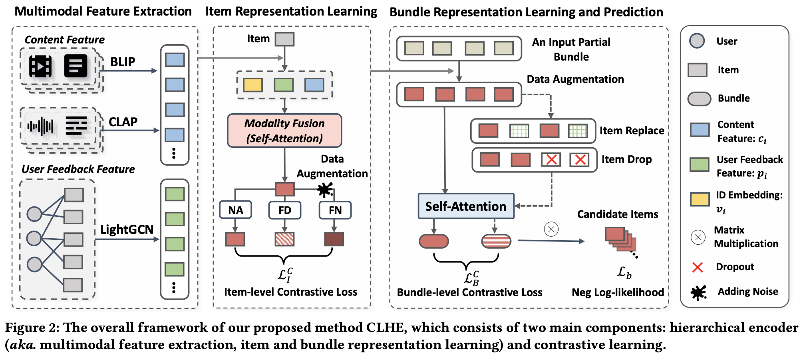

# Leveraging Multimodal Features and Item-level User Feedback for Bundle Construction

Yunshan Ma, Xiaohao Liu, Yinwei Wei, Zhulin Tao, Xiang Wang and Tat-Seng Chua



## Introduction

We address the sparsity and cold-start challenges by leveraging multimodal features and item-level user feedback. Technically, our focus is on learning effective representations by optimally unifying multiple features, while addressing the issues of modality missing, noise, and sparsity. Hence, we introduce the Contrastive Learning-enhanced Hierarchical Encoder method (CLHE). This involves a hierarchical encoder for multimodal and multi-item features, along with contrastive learning on multiple levels.

## Citation

If you want to use our codes and datasets in your research, please cite:

```biblatex
@inproceedings{CLHE2024,
  author    = {Yunshan Ma and 
               Xiaohao Liu and 
               Yinwei Wei and 
               Zhulin Tao and 
               Xiang Wang and 
               Tat{-}Seng Chua},
  title     = {Leveraging Multimodal Features and Item-level User Feedback for Bundle Construction},
  booktitle = {{WSDM}},
  publisher = {{ACM}},
  year      = {2024}
}
```

## Environment Requirements

- python == 3.7.3 or above
- supported (tested) CUDA versions: 10.2
- Pytorch == 1.9.0 or above

## Code Structure

1. Entry script for training and evaluation: `train.py`.
2. Configuration file: `config.yaml`.
3. Script for data preprocessing and dataloader: `utility.py`.
4. Model directory: `./models`.
5. Experimental logs in tensorboard-format: `./runs`.
6. Experimental logs in txt-format: `./log`.
7. The best model and associated configuration file for each experimental setting: `./checkpoints`.

For ease of understanding and implementing our model code, we've included some basic components, such as the self-attention module, in `./models/utils`.

## How to Run the Code

1. Download and decompress the dataset file into the current folder:
    > tar -zxvf dataset.tgr.gz

    We utilize POG, Spotify, and their variants as datasets. These can be downloaded from the [google drive](https://drive.google.com/file/d/1g-3c6whbAR9uEoy89Xnlb9nHeYoChopN/view?usp=sharing). If you use our dataset, please consider citing our paper. Each dataset contains several files, including ui pairs, bi pairs, categorical item information, extracted item features, and collaborative filtering item features. You can also find the download links within the `item_info.json` file if the raw data is required.

2. Train CLHE on the dataset POG_dense:
    > python3 -u train.py -g 0 --dataset="pog_dense" --model="CLHE" --item_augment="MD" --bundle_augment="ID" --bundle_ratio=0.5 --bundle_cl_temp=0.05 --bundle_cl_alpha=2 --cl_temp=0.5 --cl_alpha=0.1

    You can find hyperparameter settings for other datasets in `./run.sh`. There are two options available for configuring the hyperparameters: 1) modifying the file `config.yaml`, and 2) adding command line arguments, which can be found in the file `main.py`. We offer comprehensive and detailed choices for hyperparameter configuration, and we strongly recommend reading the paper to gain a better understanding of the effect of key hyperparameters.
